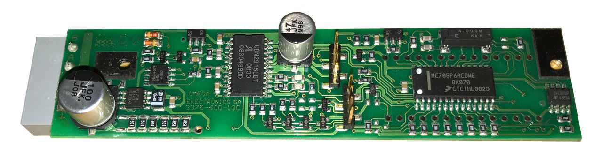
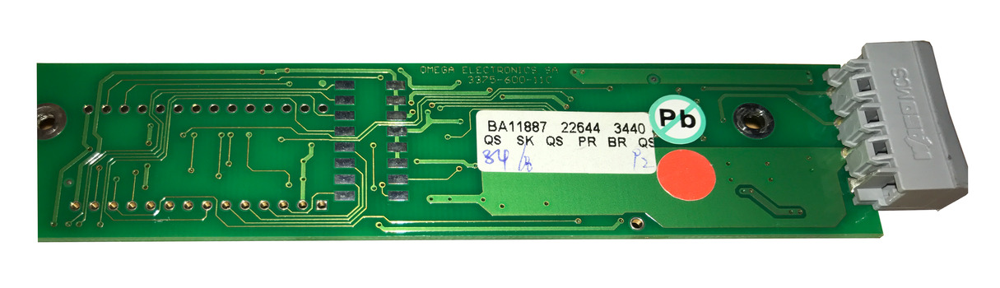

# Electrical details new module

## General

* Protocol: RS485
* Supply Voltage: 27-30V DC
  * Communication works fine with ~24V but the blades will not move with such low voltages
* Power consumption @30V:
  * Standby: 11mA
  * Flapping: 110mA

## Pinout

| Pin | Function |
|-----|----------|
| A   | Data -   |
| B   | Data +   |
|     | GND      |
| +   | VCC      |

## Images PCB

Front: 

Back:

## Parts on PCB
* MCU MC68HC705P6A (MC705P6ACDWE)
  * [Datasheet](http://www.nxp.com/assets/documents/data/en/data-sheets/MC68HC705P6A.pdf)
  * Low-Cost MC68HC05P6
  * 176 bytes RAM
  * 4672 bytes user EPROM
  * 239 bytes of bootloader ROM
  * 21 input/output (I/O) pins (20 bidirectional, 1 input-only)

* EEPROM 24C02WP
  * [Datasheet](http://www.zolilift.hu/vezerles%20arlista.pdf)
  * I2C 2K (256 x 8)

* Motor driver UD2916LBT
  * [Datasheet](http://www.allegromicro.com/~/media/Files/Datasheets/UDx2916-Datasheet.ashx?la=en)

* Serial Transceiver MAX487E
  * [Datasheet](https://datasheets.maximintegrated.com/en/ds/MAX1487E-MAX491E.pdf)

* Voltage Regulator LM78L05
  * [Datasheet](http://www.ti.com/lit/ds/symlink/lm78l05.pdf)

* Magnetic rotation sensor (Murata?) 05 s81 (BS05*s81*?)
